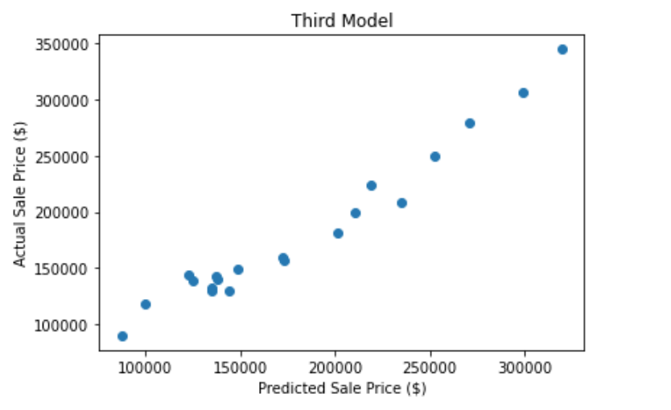

<!-- # jfkelleher96.github.io -->
<table>
  <tr>
    <td></td>
    <td><h1>John Kelleher</h1>
      <h1>MIT xPRO Certificate in Data Engineering  May 2023</h1>
      </td>
  </tr>
</table>
<b>Technical Skills:</b> &#x2022; Python &#x2022; SQL  
<h3 text-align:center>Projects</h3>
<table>
  <tr>
    <td><a href="https://github.com/jfkelleher96/Predicting-Housing-Prices">Building a Model to Predict Housing Prices </a>  
       
    This project uses multiple linear regression to predict housing prices based on a dataset for residential houses in Ames, Iowa. 
     
      Tech Stack: Python (pandas, numpy, matplotlib, sklearn, seaborn), CSV file processing </td>
    <td><a href="https://github.com/jfkelleher96/Retail-Sales-Analysis-through-Covid">Exploring Retail Sales from 2018 through 2021 and the Effects of COVID-19</a> 
      
      This project uses ETL to analyze the Monthly Retail Trade Survey (MRTS) dataset for the years 2018 through 2021. 
       
    Tech Stack: Python (matplotlib, yaml), MySQL, CSV file processing 
      </td>
  </tr>
  </table>
  
  <table>
    <tr>
    <td><a href="https://github.com/jfkelleher96/MBTA-Project">Building a Transit Data Application </a> 
     
      This project uses the API for Boston's MBTA system to display the position of buses on a map on a website. 
     
    Tech Stack: Python (pandas, matplotlib, haversine), MySQL, Flask, HTML, JSON, Docker, Maven Springboot, Debezium, CDC, nano, MongoDB, javamaven 
    </td>
    <td><a href="https://github.com/jfkelleher96/Machine-Learning/blob/main/README.md">Filtering Spam Emails using AI</a> 
       
      This project analyzes my Netflix <i>ViewingActivity.csv</i> file to track TV series I've watched from all over the world. 
     
    Tech Stack: Python, CSV file processing, HTML, Flask, machine learning 
    </td>
  </tr>
</table>
